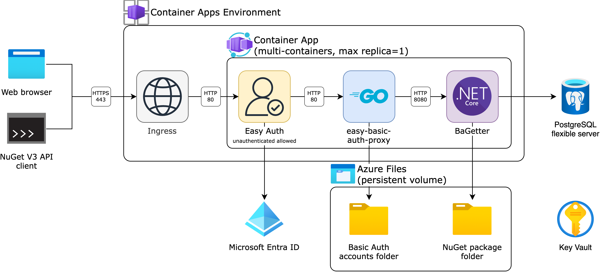
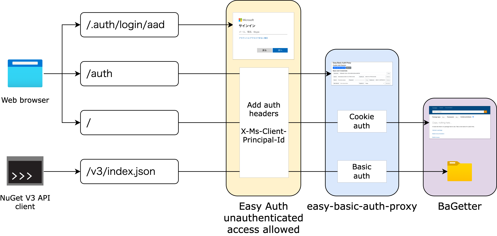
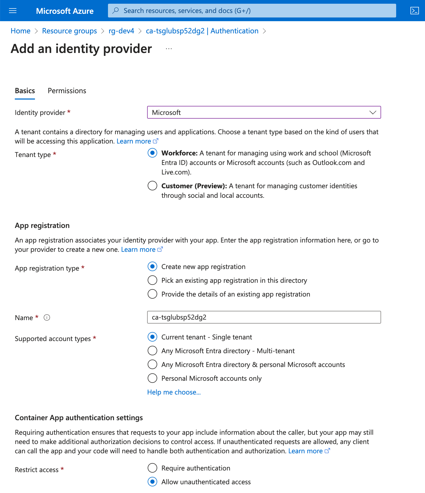
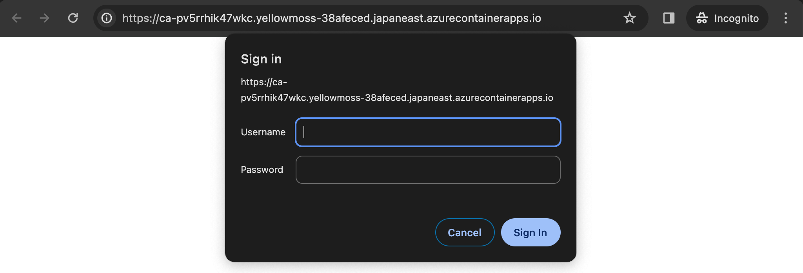
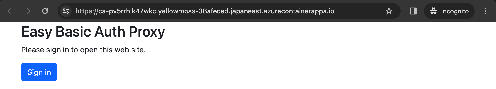
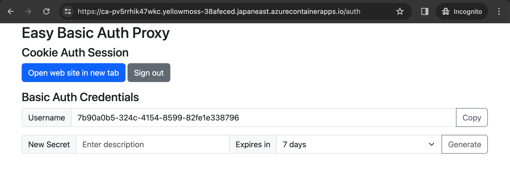
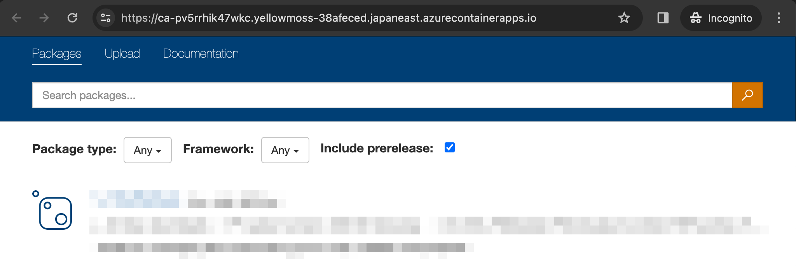

# Private NuGet Server on Azure Container Apps

## Introduction

DX2 DevOps solution for setting up a
[private NuGet server](https://learn.microsoft.com/en-us/nuget/hosting-packages/overview)
on [Azure Container Apps](https://learn.microsoft.com/ja-jp/azure/container-apps/overview).

This solution manages HTTP Basic authentication credentials for each user
who signs in with the built-in authentication of Azure Container Apps (Easy Auth).
These credentials allow users to access the server using generic NuGet V3 API clients as well as web browsers.

## Solution overview

This solution includes the following components:

- Azure container app with multiple containers, max replica count of 1:
  - [BaGetter](https://github.com/bagetter/BaGetter)
  - [easy-basic-auth-proxy](https://github.com/yaegashi/easy-basic-auth-proxy)
- Azure Files share for persistent volumes of the container app
- Azure Key Vault for secret strings for the container app including the BaGetter API key
- Microsoft Entra ID for the built-in authentication of the cotainer app (Easy Auth)
- Azure Database for PostgreSQL flexible server

> 

The following endpoints are available on a single web server:

|URL path|Component|Description|
|-|-|-|
|`/`|BaGetter|BaGetter website|
|`/v3/index.json`|BaGetter|Service index for NuGet V3 API|
|`/auth`|easy-basic-auth-proxy|Configuration for Easy Basic Auth Proxy|
|`/auth/debug`|easy-basic-auth-proxy|Dump request headers for debugging|
|`/.auth/login/aad`|Easy Auth|Login via Easy Auth (Microsoft Entra ID)|

> 

The locations for persistent data storage are as follows:

|Data|Location|
|-|-|
|User authentication data|Azure Files share|
|Nupkg files|Azure Files share|
|Nupkg indexes/statistics|Azure Database for PostgreSQL|

## Deploy the solution

This solution utilizes [the Azure Developer CLI](https://learn.microsoft.com/en-us/azure/developer/azure-developer-cli/overview) to provision Azure resources.
After provisioning, you will need to configure the container app in the Azure Portal.

1. Provision Azure resources using this repository as the template:
    ```console
    $ mkdir my-nuget-server
    $ cd my-nuget-server
    $ azd init -t https://github.com/yaegashi/dx2devops-nuget-server
    $ azd auth login
    $ azd provision

    Provisioning Azure resources (azd provision)
    Provisioning Azure resources can take some time.

    ? Select an Azure Subscription to use:  2. VSE (9473abf6-f25e-420e-b3f2-128c1c7b46f2)
      (✓) Done: Retrieving locations...
    ? Select an Azure location to use:  9. (Asia Pacific) Japan East (japaneast)
    Subscription: VSE (9473abf6-f25e-420e-b3f2-128c1c7b46f2)
    Location: Japan East

      You can view detailed progress in the Azure Portal:
      https://portal.azure.com/#view/HubsExtension/DeploymentDetailsBlade/~/overview/id/%2Fsubscriptions%2F9473abf6-f25e-420e-b3f2-128c1c7b46f2%2Fproviders%2FMicrosoft.Resources%2Fdeployments%2Fdev4-1702532493

      (✓) Done: Resource group: rg-dev4
      (✓) Done: Log Analytics workspace: log-tsglubsp52dg2
      (✓) Done: Key Vault: kv-tsglubsp52dg2
      (✓) Done: Storage account: sttsglubsp52dg2
      (✓) Done: Application Insights: appi-tsglubsp52dg2
      (✓) Done: Portal dashboard: dash-tsglubsp52dg2
      (✓) Done: Container Apps Environment: cae-tsglubsp52dg2
      (✓) Done: Azure Database for PostgreSQL flexible server: psql-tsglubsp52dg2
      (✓) Done: Container App: ca-tsglubsp52dg2

    Container app link in the Azure Portal:
    https://portal.azure.com/bcd388dd-3247-4137-9a8d-a55a4b2de147#/resource/subscriptions/9473abf6-f25e-420e-b3f2-128c1c7b46f2/resourceGroups/rg-dev4/providers/Microsoft.App/containerApps/ca-tsglubsp52dg2

    Easy Basic Auth Proxy configuration link:
    https://ca-tsglubsp52dg2.bluedune-54ef5b3c.japaneast.azurecontainerapps.io/auth

    BaGetter website link:
    https://ca-tsglubsp52dg2.bluedune-54ef5b3c.japaneast.azurecontainerapps.io

    BaGetter API key link in the Azure Portal:
    https://portal.azure.com/bcd388dd-3247-4137-9a8d-a55a4b2de147#asset/Microsoft_Azure_KeyVault/Secret/https://kv-tsglubsp52dg2.vault.azure.net/secrets/apiKey

    SUCCESS: Your application was provisioned in Azure in 6 minutes 18 seconds.
    You can view the resources created under the resource group rg-dev4 in Azure Portal:
    https://portal.azure.com/#@/resource/subscriptions/9473abf6-f25e-420e-b3f2-128c1c7b46f2/resourceGroups/rg-dev4/overview
    ```
2. Open the container app link in the Azure Portal,
enable the built-in authentication.
    - Select **Microsoft** as the **Identity provider** (Microsoft Entra ID)
    - Enable **Allow unauthenticated access** in the **Restrict access** options
    > 
3. (Optional) Configure [the authConfigs resource](https://learn.microsoft.com/en-us/azure/templates/microsoft.app/containerapps/authconfigs)
to grant access only to specific user groups.
4. (Optional) Configure [the custom domain](https://learn.microsoft.com/en-us/azure/container-apps/custom-domains-managed-certificates) on the website.

## Access the BaGetter website

1. Navigate to the BaGetter website link.  You will be prompted for Basic Auth credentials.  Simply click **Cancel** at this stage.
    > 
2. You will see the Easy Basic Auth Proxy blank page.  Click **Sign in** button.  This will redirect you to the Microsoft website where you can sign in with your ME-ID account.
    > 
3. Once authenticated, you will be redirected to the Easy Basic Auth Proxy configuration.  Click the **Open website in new tab** button.
    > 
4. You should now be able to see the BaGetter website.
    > 

## Access the NuGet feed with V3 API clients

1. Register the feed `MyFeed` with your credentials from the Easy Basic Auth Proxy configuration.
    ```console
    dotnet nuget add source \
        -n MyFeed \
        -u USERNAME \
        -p PASSWORD \
        --store-password-in-clear-text \
        https://ca-XXX.YYY-ZZZ.japaneast.azurecontainerapps.io/v3/index.json
    ```
    Or create the file `NuGet.config` with the following content:
    ```xml
    <?xml version="1.0" encoding="utf-8"?>
    <configuration>
      <packageSources>
        <add key="MyFeed" value="https://ca-XXX.YYY-ZZZ.japaneast.azurecontainerapps.io/v3/index.json" />
      </packageSources>
      <packageSourceCredentials>
        <MyFeed>
          <add key="Username" value="USERNAME" />
          <add key="ClearTextPassword" value="PASSWORD" />
        </MyFeed>
      </packageSourceCredentials>
    </configuration>
    ```
2. Upload a NuGet package (`API-TOKEN` is available at BaGetter API key link in the Azure Portal):
    ```console
    dotnet nuget push -s MyFeed -k API-TOKEN package.nupkg
    ```
